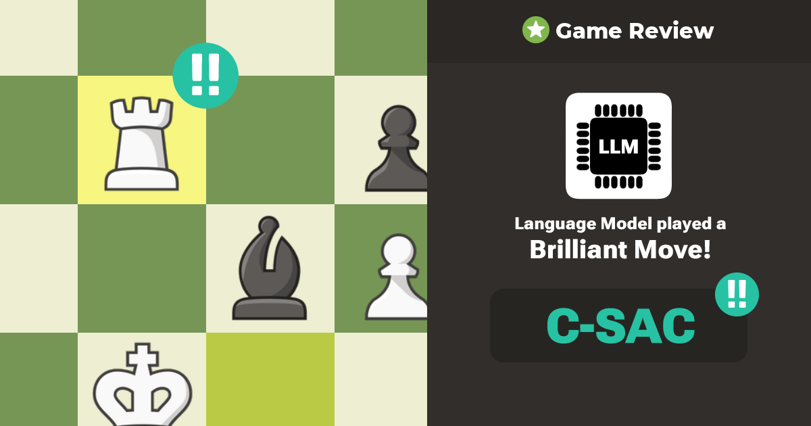
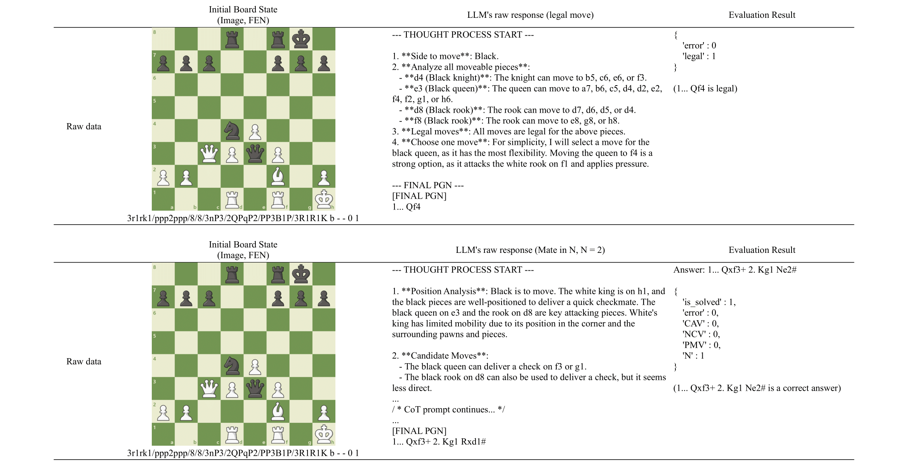

# C-SAC Project

<!--  -->

### Author: [Wonseuk Lee (Justin Lee)](https://www.linkedin.com/in/wonseuk-lee-7996651bb/)

University of California, Irvine Master of Computer Science
Pennsylvania State University, University Park, Bachelor of Science, Computer Science

<!-- > Still not employed :( -->

## Table of Content
- [Introduction](#introduction)
- [Code Structure](#Code-Structure)
- [Database Properties](#database-properties)
- [Sample Data](#sample-images)
- [Citing](#citing)

## Introduction
This repository is an appendix material of an empirical research project of measuring LLM's iterative sequential reasoning ability on rule‑based environment, Mate in N chess Puzzle.

It was entirely build from scratch and contains code in Python to evaluate reasoning abilities of different large language models(LLMs), and how LLMs abilities to maintain constraints breaks down (i.e. directions provided in prompts, chess rules that knowns for LLMs already understood, etc.). 

To install all dependencies, please install following dependencies via using this scripts:
```
pip install pandas
```

## Code Structure
The structure of repository is the following :

```
├── images                              # Folder with images used in this document
├── Prompt_A                            # Results made with A type prompts
|   ├── legal_moves                     # Test results of Legal Move Counts tests
|   |   ├── Deepseek-Alpha              # Raw data & Parsed data of LLM's response to prompt
|   |   ├── Gemini_2.5_Pro              # ...
|   |   ├── GPT-4o                      # ...
|   |   ├── Grok-3                      # ...
|   |   ├── Llama-4-Maverik             # ...
|   |   ├── results_Deepseek-Alpha.csv  # Binary data of test results
|   |   ├── results_Gemini_2.5_Pro.csv  # ...
|   |   ├── results_GPT-4o.csv          # ...
|   |   ├── results_Grok-3.csv          # ...
|   |   ├── results_Llama-4-Maverik.csv # ...
|   ├── puzzle_test                     # Test results of Puzzle Solving tests
|   |   ├── ...                         # (Same datastructure as legal_moves folder)
├── Prompt_B                            # Results made with B type prompts 
|   ├── ...                             # (Same datastructure as Prompt_A folder)
├── src                                 # Folder with all source files
|   ├── CS_sensor.py                    # Use parsed data of LLM's response and sense Constraint Sacrifice 
|   ├── LM_sensor.py                    # Use parsed data of LLM's response and evaluate legality of moves
|   ├── pgn_parser_LM.py                # Parse raw response for Legal Move Counts tests
|   ├── pgn_parser_PZ.py                # Parse raw response for Puzzle Solving tests
|   ├── prompter.py                     # Test all puzzles & models with all tests
|   ├── puzzle_PGN.csv                  # Data of all puzzles
|   ├── run.bat                         # Executable batch file to run all Python scripts in proper order
├── LICENSE                             # License file
└── README.md                           # Document you are reading now
``` 

To run the test, you can simply run `run.bat` file to execute all Python sripts in proper order. Before running source files, you must add your API keys and (if possible) endpoints to connect with AzureOpenAI or Google AI Studio services.

## Database Properties
C-SAC Project consists of 40 different unique Mate-in-N puzzle problems. One puzzle problem provides an initial board position of the puzzle with Forsyth–Edwards Notation(FEN) and an exact & unique solution of the puzzle with Portable Game Notation (PGN). 10 unique puzzle positions are selected and controlled for difficulty at each depth N. These 10 puzzles are consisted with 5 White-to-move puzzles and 5 Black-to-move puzzles, creating a total of 40 test environments with even numbers of White-to-move and Black-to-move puzzles. Except for puzzles of N = 1, the model must generate valid response moves of the opponent, which will be always forced moves. The current state of the chessboard is encoded using the FEN.Unique Solution and Minimal Solution Sequence is validated through Stockfish engine depth of N = 20 ~ 25 provided by Chess.com. This setup aims to precisely measure the collapse phenomenon in LLM performance as N increases.

These puzzles are used to create test prompts to evaluate modern LLMs' iterative sequential reasoning availability and understandability of chess rules. Two types of prompt templates are used to test the robustness towards prompts of this research. LLMs are first evaluated their understandability of chess rules by generating one legal move provided with FEN of puzzles. Then LLMs are evaluated their iterative sequential reasoning availability by solving Mate-in-N puzzles. All response must be made with PGN.

Please see an empirical research article (arXiv hyperlink here in future...).for more detail.

## Sample Data

Below some sample puzzles and raw response are shown including results of evaluations.




## Citing

If you use this work, please cite the following papers.
(arXiv hyperlink here in future...) 
